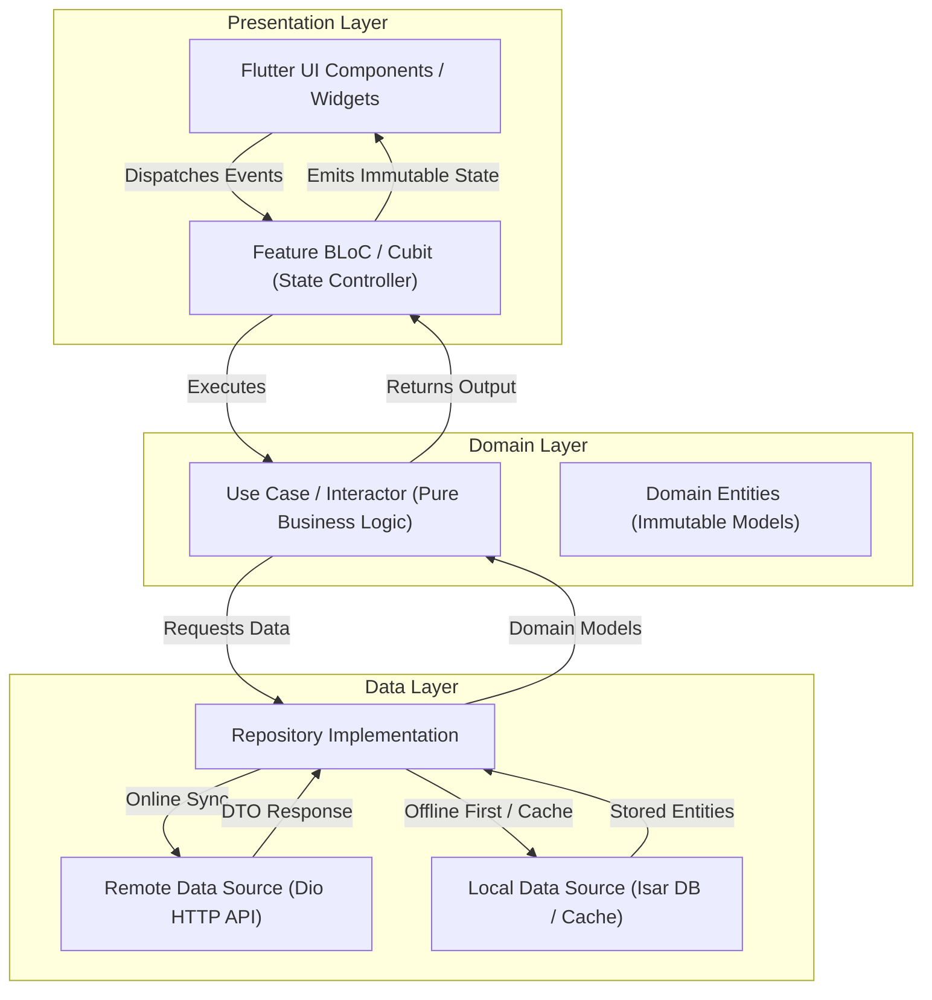
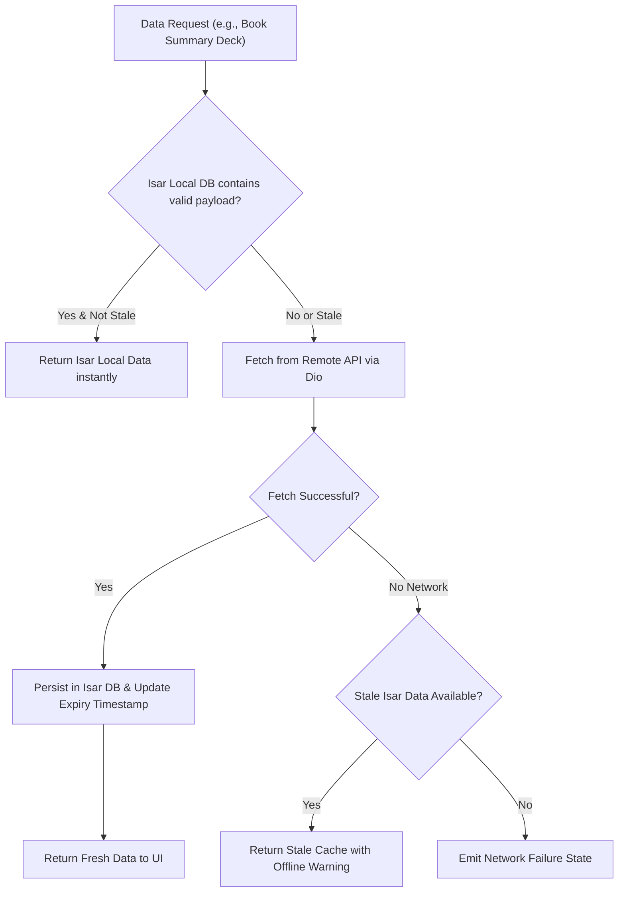

# Technical Design Document (TDD) & Engineering Implementation Plan
## Project: Roshana (روشنا) — Enterprise Micro-Learning & Book Summary Platform

**Document Status:** Approved MVP Architecture Baseline (Updated Scope)  
**Target Platform:** iOS, Android, macOS (Flutter Cross-Platform)  
**Author:** Lead Flutter Systems Architect & Mobile Infrastructure Engineer  

---

## Executive Summary & System Vision

**Roshana (روشنا)** is an enterprise-grade micro-learning platform engineered for the global Persian-speaking diaspora across Iran, Afghanistan, and worldwide English-speaking communities. The platform delivers bite-sized non-fiction summaries through interactive swipeable cards, synchronized professional audio narration, gamified daily habit loops, spaced-repetition memory retention (SRS), and seamless global monetization.

*Note: In accordance with MVP optimizations, Tajiki Cyrillic script (`tg_TJ`) and AI streaming conversational assistants are omitted for the initial release to ensure zero script errors and maximum operational stability.*

---

## 1. Clean Architecture Directory Structure

Roshana adopts a **Feature-First Clean Architecture** with strict modularity, separating domain business logic from data sources and presentation layers.

```
lib/
├── app/
│   ├── app.dart                        # MaterialApp.router configuration, Theme & i18n initialization
│   ├── bootstrap.dart                  # Global error handlers, Zone initialization, Service Locator (GetIt) setup
│   └── router/                         # GoRouter route definitions, guards, and redirection logic
│       ├── app_router.dart
│       └── route_guards.dart
├── core/                               # Cross-cutting foundational modules
│   ├── constants/                      # App-wide constants (Asset paths, DB names, API endpoints)
│   ├── error/                          # Exception handling, Failures hierarchy (`Failure`, `ServerFailure`, `CacheFailure`)
│   ├── i18n/                           # Localization pipeline, Google Fonts mapping & baseline normalization
│   │   ├── app_locale.dart             # Supported locale definitions (fa_IR, fa_AF, en_US)
│   │   ├── font_resolver.dart          # Google Fonts stack resolver (Vazirmatn & Inter)
│   │   └── locale_notifier.dart        # Localized state controller with persistent override logic
│   ├── network/                        # HTTP client (Dio), interceptors, retry policies
│   ├── storage/                        # Isar database singleton, secure storage wrappers, cache manager
│   ├── theme/                          # Dynamic dark/light color palettes, typography specs, material 3 design tokens
│   └── utils/                          # Date/time utilities, text parsers, math helpers for SRS
├── features/                           # Feature modules (Feature-First architecture)
│   ├── auth/                           # Authentication & User Profile Management
│   │   ├── data/                       # Remote Auth API, OAuth providers, Local Token Storage
│   │   ├── domain/                     # User entity, Login/Register use cases
│   │   └── presentation/               # Onboarding, Auth screens, User BLoC
│   ├── gamification/                   # Daily Streak Engine & Habit Gamification
│   │   ├── data/                       # Streak Isar collections, local notification scheduler
│   │   ├── domain/                     # Streak calculation engine, Streak Freeze use cases
│   │   └── presentation/               # Streak widget, Freeze celebration modals, Habit BLoCs
│   ├── library/                        # Book Discovery & Personal Learning Paths
│   │   ├── data/                       # Book catalog API, Isar offline cache, tag filtering
│   │   ├── domain/                     # Book summary entity, Tagging algorithms, search use cases
│   │   └── presentation/               # Catalog grid, category filters, personalized recommendations UI
│   ├── reader_player/                  # Card Deck Reader & Audio Sync Subsystem
│   │   ├── data/                       # Audio file downloader, position cache, takeaway card data sources
│   │   ├── domain/                     # Deck reader entity, Audio position sync engine use case
│   │   └── presentation/               # Interactive swipeable card deck, Audio player controls widget
│   ├── srs_flashcards/                 # Spaced-Repetition System (SM-2 Algorithm)
│   │   ├── data/                       # Flashcard Isar collections, SRS sync logic
│   │   ├── domain/                     # Flashcard entity, SM-2 retention algorithm implementation
│   │   └── presentation/               # Review deck UI, mastery progress charts, SRS BLoC
│   └── subscription/                   # Diaspora Monetization & Paywalls
│       ├── data/                       # RevenueCat SDK wrapper, Entitlement cache repository
│       ├── domain/                     # CustomerInfo entity, Paywall config use cases
│       └── presentation/               # Server-driven dynamic paywalls, subscription tier UI
└── l10n/                               # Localization ARB template files
    ├── app_en.arb                      # English string definitions
    ├── app_fa_AF.arb                   # Afghan Persian (Dari) override strings
    └── app_fa_IR.arb                   # Iranian Persian (Farsi) base strings
```

---

## 2. State Management Strategy & Flow Architecture

Roshana uses the **BLoC (Business Logic Component)** pattern backed by `flutter_bloc` and `freezed` for immutable state modeling. Unidirectional data flow ensures predictive state changes, robust testability, and isolated business logic.

### Unidirectional Data Flow Architecture



---

## 3. Offline Storage & Caching Layer

Roshana implements a **Cache-First Hybrid Strategy** engineered to ensure flawless offline playback and micro-card reading in connectivity-restricted environments.



### Caching Tiers Architecture
1. **Isar Embedded Database (NoSQL Caching):** Stores user profiles, downloaded book summary decks, takeaway cards, daily streak stats, and SRS flashcard states.
2. **Audio Disk Cache (`flutter_cache_manager`):** Downloaded MP3/AAC audio files stored with LRU (Least Recently Used) eviction rules (capped at 500 MB).
3. **Offline SRS Execution Queue:** Flashcard reviews completed offline are queued in Isar and synced asynchronously upon reconnection.

---

## 4. Data Models & Schema Definitions

```dart
import 'package:isar/isar.dart';

part 'data_models.g.dart';

/// User Profile Collection
@collection
class UserModel {
  Id id = Isar.autoIncrement;

  @Index(unique: true, replace: true)
  late String userId;

  late String email;
  late String displayName;
  late String preferredLocale; // e.g., 'fa_IR', 'fa_AF', 'en_US'
  late String selectedScript;   // 'Arabic', 'Latin'

  late DateTime createdAt;
  late DateTime lastActiveAt;

  final streakData = IsarLink<StreakDataModel>();
  final subscription = IsarLink<SubscriptionStatusModel>();
}

/// Book Summary Meta Collection
@collection
class BookSummaryModel {
  Id id = Isar.autoIncrement;

  @Index(unique: true, replace: true)
  late String summaryId;

  late String title;
  late String originalAuthor;
  late String coverImageUrl;
  late String category;
  late int totalReadingMinutes;

  late String faIrTitle;
  late String faAfTitle;
  late String enUsTitle;

  List<String> tags = [];
  final cards = IsarLinks<TakeawayCardModel>();
}

/// Individual Micro-Learning Card Collection
@collection
class TakeawayCardModel {
  Id id = Isar.autoIncrement;

  @Index(unique: true, replace: true)
  late String cardId;

  late String summaryId;
  late int cardIndex; // Order in deck
  late String cardType; // 'core_takeaway', 'key_principle', 'action_insight'

  late String contentTextFaIr;
  late String contentTextFaAf;
  late String contentTextEnUs;

  // Audio Sync Offsets (in milliseconds)
  late int audioStartMs;
  late int audioEndMs;
  late String audioNarrationUrl;
}

/// Gamification & Daily Streak Data Collection
@collection
class StreakDataModel {
  Id id = Isar.autoIncrement;

  @Index(unique: true, replace: true)
  late String userId;

  late int currentStreakDays;
  late int longestStreakDays;
  late DateTime lastCompletedDate;
  late int availableStreakFreezes;

  List<String> activeBadges = [];
  List<DateTime> completionHistory = [];
}

/// Spaced-Repetition System (SM-2 Algorithm) Flashcard Model
@collection
class FlashcardItemModel {
  Id id = Isar.autoIncrement;

  @Index(unique: true, replace: true)
  late String flashcardId;

  late String cardId;
  late String question;
  late String answer;

  // SM-2 Algorithmic Parameters
  late double easinessFactor; // Default 2.5
  late int intervalDays;       // Days until next review
  late int repetitions;        // Successful streak count
  late DateTime nextReviewDueDate;
  late DateTime lastReviewedAt;
}

/// Subscription Entitlement Status Model
@collection
class SubscriptionStatusModel {
  Id id = Isar.autoIncrement;

  @Index(unique: true, replace: true)
  late String userId;

  late bool isProActive;
  late String activeTier; // 'free', 'monthly_pro', 'annual_pro'
  late String originalPurchaseId;
  late DateTime? expirationDate;
  late DateTime entitlementCachedAt;
  late bool isInOfflineGracePeriod;
}
```

---

## 5. API & Service Contracts

### A. Audio Player Sync Subsystem Interface
```dart
import 'dart:async';

enum AudioSyncState { idle, buffering, playing, paused, completed, error }

class SyncPositionPayload {
  final Duration currentPosition;
  final Duration totalDuration;
  final int activeCardIndex;
  final String? activeWordHighlight;

  SyncPositionPayload({
    required this.currentPosition,
    required this.totalDuration,
    required this.activeCardIndex,
    this.activeWordHighlight,
  });
}

abstract class IAudioPlayerSyncService {
  Stream<AudioSyncState> get playbackStateStream;
  Stream<SyncPositionPayload> get syncPositionStream;

  Future<void> loadSummaryAudio({
    required String audioUrl,
    required List<Map<String, dynamic>> cardTimecodes,
  });

  Future<void> play();
  Future<void> pause();
  Future<void> seekToCard(int cardIndex);
  Future<void> setPlaybackSpeed(double speed);
  Future<void> dispose();
}
```

### B. RevenueCat Integration Service Interface
```dart
abstract class IRevenueCatSubscriptionService {
  /// Initializes the RevenueCat SDK with user identification
  Future<void> initialize(String userId);

  /// Checks if user holds active 'pro_access' entitlement (cached + server sync)
  Future<bool> isEntitledToPro();

  /// Fetches current dynamic paywall offerings
  Future<List<dynamic>> fetchOfferings();

  /// Triggers native IAP workflow for selected package
  Future<bool> purchasePackage(dynamic packageToPurchase);

  /// Restores historical user purchases
  Future<bool> restorePurchases();
}
```

---

## 6. Localization Pipeline & Google Fonts Integration Code Sample

The following implementation configures dynamic locale resolution (`fa_IR`, `fa_AF`, `en_US`), automatic RTL vs LTR script directionality, fallback inheritance (`fa_AF` -> `fa_IR`), and the MVP **Google Fonts Stack (`Vazirmatn` & `Inter`)**.

```dart
import 'package:flutter/material.dart';
import 'package:flutter_localizations/flutter_localizations.dart';
import 'package:google_fonts/google_fonts.dart';

/// 1. Locale Enum & Directionality Metadata
enum RoshanaLocale {
  faIR(Locale('fa', 'IR'), TextDirection.rtl, 'Arabic'),
  faAF(Locale('fa', 'AF'), TextDirection.rtl, 'Arabic'),
  enUS(Locale('en', 'US'), TextDirection.ltr, 'Latin');

  final Locale locale;
  final TextDirection direction;
  final String scriptFamily;

  const RoshanaLocale(this.locale, this.direction, this.scriptFamily);

  static RoshanaLocale fromLocale(Locale locale) {
    return RoshanaLocale.values.firstWhere(
      (element) => element.locale.languageCode == locale.languageCode,
      orElse: () => RoshanaLocale.faIR,
    );
  }
}

/// 2. MVP Google Fonts Dynamic Typography Engine
class RoshanaTypography {
  static TextStyle getTextStyle({
    required RoshanaLocale currentLocale,
    double fontSize = 16.0,
    FontWeight fontWeight = FontWeight.normal,
    Color? color,
  }) {
    if (currentLocale.scriptFamily == 'Arabic') {
      // Google Font: Vazirmatn for Persian (fa_IR) & Dari (fa_AF)
      return GoogleFonts.vazirmatn(
        fontSize: fontSize,
        fontWeight: fontWeight,
        height: 1.65, // Enhanced height for Arabic diacritics
        color: color ?? Colors.white,
      );
    } else {
      // Google Font: Inter for English (en_US)
      return GoogleFonts.inter(
        fontSize: fontSize,
        fontWeight: fontWeight,
        height: 1.3,
        letterSpacing: 0.2,
        color: color ?? Colors.white,
      );
    }
  }
}

/// 3. App Localizations Config & Fallback Delegate
class RoshanaLocalizationConfig {
  static const List<Locale> supportedLocales = [
    Locale('fa', 'IR'),
    Locale('fa', 'AF'),
    Locale('en', 'US'),
  ];

  static const List<LocalizationsDelegate<dynamic>> localizationsDelegates = [
    GlobalMaterialLocalizations.delegate,
    GlobalWidgetsLocalizations.delegate,
    GlobalCupertinoLocalizations.delegate,
  ];

  /// Locale resolution callback handling Dari (`fa_AF`) fallback inheritance to `fa_IR`
  static Locale localeResolutionCallback(Locale? locale, Iterable<Locale> supported) {
    if (locale == null) return const Locale('fa', 'IR');

    for (var supportedLocale in supported) {
      if (supportedLocale.languageCode == locale.languageCode &&
          supportedLocale.countryCode == locale.countryCode) {
        return supportedLocale;
      }
    }

    // Fallback: Dari (fa_AF) -> Farsi (fa_IR)
    if (locale.languageCode == 'fa' && locale.countryCode == 'AF') {
      return const Locale('fa', 'IR');
    }

    return const Locale('fa', 'IR');
  }
}

/// 4. Root Application Wrapper demonstrating Locale & Directionality Integration
class RoshanaAppRoot extends StatelessWidget {
  final Locale currentAppLocale;

  const RoshanaAppRoot({Key? key, required this.currentAppLocale}) : super(key: key);

  @override
  Widget build(BuildContext context) {
    final activeRoshanaLocale = RoshanaLocale.fromLocale(currentAppLocale);

    return MaterialApp(
      title: 'Roshana',
      debugShowCheckedModeBanner: false,
      locale: currentAppLocale,
      supportedLocales: RoshanaLocalizationConfig.supportedLocales,
      localizationsDelegates: RoshanaLocalizationConfig.localizationsDelegates,
      localeResolutionCallback: RoshanaLocalizationConfig.localeResolutionCallback,
      theme: ThemeData(
        brightness: Brightness.dark,
        scaffoldBackgroundColor: const Color(0xFF0F172A),
        textTheme: GoogleFonts.vazirmatnTextTheme(ThemeData.dark().textTheme),
      ),
      builder: (context, child) {
        // Enforce Directionality & Dynamic Layout Mirroring (RTL vs LTR)
        return Directionality(
          textDirection: activeRoshanaLocale.direction,
          child: child ?? const SizedBox.shrink(),
        );
      },
      home: Scaffold(
        body: Center(
          child: Text(
            'روشنا — Micro-Learning Book Summaries',
            style: RoshanaTypography.getTextStyle(
              currentLocale: activeRoshanaLocale,
              fontSize: 22,
              fontWeight: FontWeight.bold,
              color: Colors.white,
            ),
          ),
        ),
      ),
    );
  }
}
```

---

## 7. Phased 6-Sprint Implementation Roadmap (MVP Optimized)

| Sprint | Phase Focus | Key Deliverables & Engineering Scope | Testing Criteria & Verification |
| :--- | :--- | :--- | :--- |
| **Sprint 1** | **Foundations & Google Fonts i18n** | - Feature-First directory structure initialization<br>- Multi-locale pipeline (`fa_IR`, `fa_AF`, `en_US`) with Google Fonts (`Vazirmatn` & `Inter`) integration<br>- Isar Local Database initialization & baseline schemas | - 100% i18n key coverage test<br>- Script directionality snapshot tests for RTL (`fa_IR`/`fa_AF`) & LTR (`en_US`) layouts |
| **Sprint 2** | **Reader Engine & Audio Sync** | - Custom modular swipeable card deck component with haptic feedback<br>- `just_audio` + `audio_service` integration for word/card position sync<br>- Audio disk cache & pre-fetching manager | - Micro-second audio sync accuracy test<br>- Memory leak checks during continuous deck swiping |
| **Sprint 3** | **Gamification & Habit System** | - Timezone-aware Daily Streak Engine with local & cloud sync<br>- Streak Freeze protection & repair logic<br>- Contextual local push notifications via `flutter_local_notifications` | - Time-travel simulation unit tests (midnight boundary resets)<br>- Local notification payload verification |
| **Sprint 4** | **SRS Flashcard Retention Engine** | - Spaced-Repetition Memory Engine utilizing SM-2 algorithm<br>- Offline review queue with Isar persistence<br>- Tag-based learning pathway recommendations | - SM-2 calculation mathematical unit tests<br>- SRS review queue persistence & sync tests |
| **Sprint 5** | **Monetization & Paywalls** | - RevenueCat SDK integration (`purchases_flutter`)<br>- Server-driven dynamic paywalls with A/B testing support<br>- Offline entitlement caching with grace period fallback | - Sandbox purchase validation on iOS App Store & Google Play<br>- Offline entitlement access verification |
| **Sprint 6** | **Hardening & Store Release** | - End-to-End integration testing & performance profiling<br>- Security audit (SSL pinning, secure storage checks)<br>- CI/CD setup (Fastlane + GitHub Actions) & Store Submissions | - Zero high-severity bugs in Crashlytics<br>- Production release builds submitted to Apple App Store & Google Play |

---

## Verification & Deployment Strategy

1. **Static Analysis & Linting:** Enforce strict Dart rules with `very_good_analysis`.
2. **Automated Testing Matrix:**
   - **Unit Tests:** `flutter test` for SM-2 logic, i18n fallbacks (`fa_AF` -> `fa_IR`), and Streak calculation engines.
   - **Widget Tests:** Test swipe gestures, card deck stack behavior, and dynamic directionality toggling.
3. **Release Build Pipelines:** Fastlane automation for seamless App Store Connect & Google Play Console releases.
